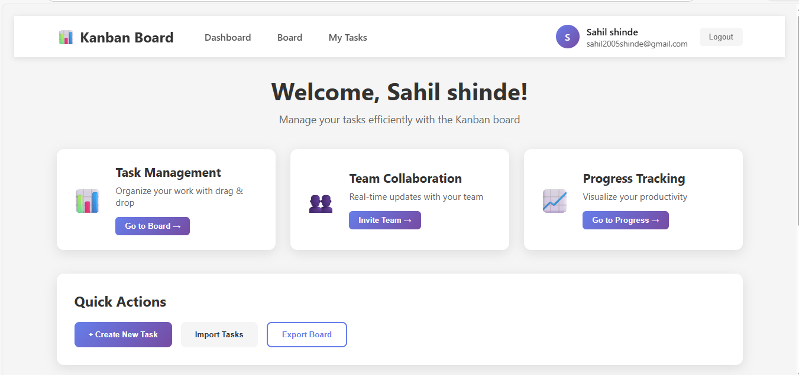
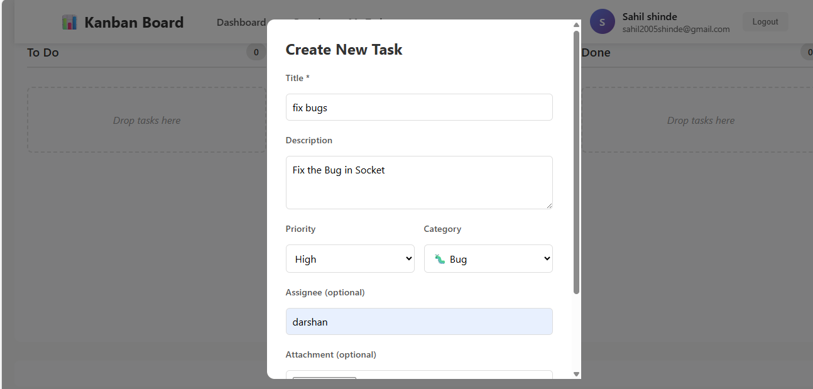
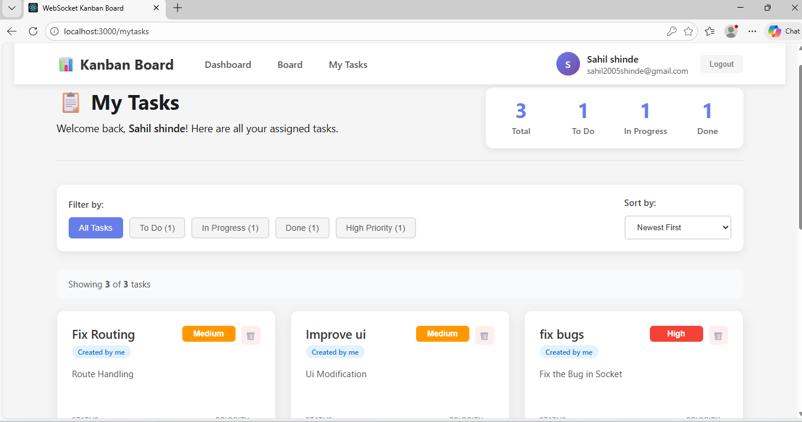

# 📝 WebSocket‑Powered Kanban Board

<p align="center">
  <b>Real‑time collaborative task management built with React, Node.js, and Socket.IO</b>
</p>

<p align="center">
  
  
  
  
  
</p>

---

## 🚀 Overview

A **real‑time multi‑user Kanban board** where users can create, edit, move, and track tasks instantly.
Includes **file uploads, analytics charts, drag‑and‑drop workflow, and full automated testing**.

---

## ✨ Key Features

### 🏗 Core Kanban

* ⚡ Real‑time updates via **WebSockets**
* 🖱 Drag & drop across **To Do → In Progress → Done**
* 📝 Full **CRUD** task management
* 🎯 Priority levels with color badges
* 🏷 Category icons (Bug, Feature, Enhancement)
* 📎 File attachments with validation

### 📊 Analytics

* Progress charts using **Recharts**
* Status & priority distribution
* Auto completion percentage
* Live chart updates on task movement

### 🤝 Collaboration

* Multi‑user instant sync
* Task assignee tracking
* Connection status indicator
* Disconnect error handling

### 🧪 Testing

* **Unit:** Vitest + RTL
* **Integration:** WebSocket flows
* **E2E:** Playwright workflows
* **Coverage reports** included

---

## 🖼 UI Preview

```
┌──────────────────────────────────────────────┐
│                  Kanban Board                 │
├─────────────┬──────────────┬──────────────────┤
│   To Do     │ In Progress  │      Done        │
├─────────────┼──────────────┼──────────────────┤
│   Tasks     │    Tasks     │      Tasks       │
├─────────────┴──────────────┴──────────────────┤
│               Progress Charts                 │
└──────────────────────────────────────────────┘
```

---

## 📸 Screenshots

### 🏠 Kanban Board View



### 📝 Task Creation / Edit



### 📊 Progress Analytics



### Drag-Drop Feature


---

## 🛠 Tech Stack

### Frontend

* React 18
* React DnD
* Socket.IO Client
* Recharts
* Axios
* Vitest + React Testing Library
* Playwright

### Backend

* Node.js + Express
* Socket.IO
* Multer (file uploads)
* CORS security

---

## 📂 Project Structure

```
websocket-kanban-vitest-playwright-2026/
├── backend/
├── frontend/
└── README.md
```

---

## ⚙️ Setup

### 1️⃣ Clone

```bash
git clone https://github.com/vyorius/websocket-kanban-vitest-playwright-2026.git
cd websocket-kanban-vitest-playwright-2026
```

### 2️⃣ Backend

```bash
cd backend
npm install
npm start
```

➡ Runs on **[http://localhost:5000](http://localhost:5000)**

### 3️⃣ Frontend

```bash
cd frontend
npm install
npm start
```

➡ Runs on **[http://localhost:3000](http://localhost:3000)**

---

## 🧪 Testing

### Vitest

```bash
npm test
npm run coverage
```

### Playwright

```bash
npm run test:e2e
npm run test:e2e:headed
npm run test:e2e:ui
```

---

## 🔌 API & WebSockets

### REST

| Method | Endpoint             | Purpose     |
| ------ | -------------------- | ----------- |
| POST   | `/api/upload`        | Upload file |
| GET    | `/uploads/:filename` | Access file |

### Socket Events

**Client → Server**

* `task:create`
* `task:update`
* `task:move`
* `task:delete`

**Server → Client**

* `sync:tasks`
* `task:created`
* `task:updated`
* `task:moved`
* `task:deleted`

---

## 🔐 Security

* File size/type validation
* Sanitized inputs
* Restricted CORS
* Graceful error boundaries

---

## 📱 Responsive Design

* Desktop → 3 columns
* Tablet → 2 columns
* Mobile → 1 column + touch drag

---

## 🐛 Troubleshooting

**WebSocket fails**

* Backend must run on **5000**
* Check CORS & firewall

**Upload fails**

* Ensure `uploads/` exists
* Max **5MB** limit

**Drag‑drop broken**

* Verify React DnD backend

---

## 🏆 Skills Demonstrated

* Real‑time architecture
* Modern React patterns
* Automated testing strategy
* Clean scalable structure
* Production‑ready UI/UX

---

## 🤝 Contributing

```bash
Fork → Branch → Commit → Push → Pull Request
```

---

## 👤 Author

**Sahil Shinde**
Real‑time systems • Full‑stack development • Testing‑focused engineering

---

<p align="center"><b>⭐ Star this repo if you found it useful</b></p>
